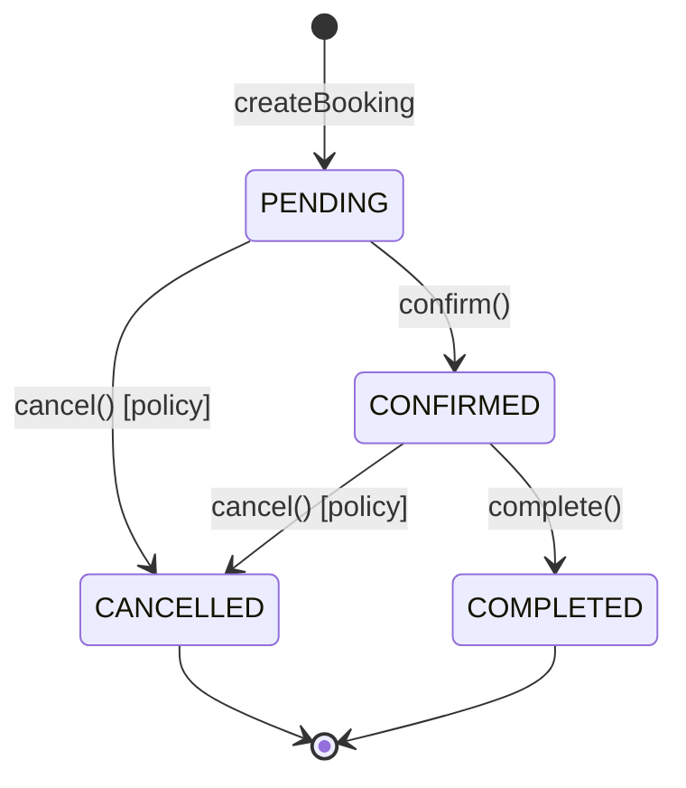
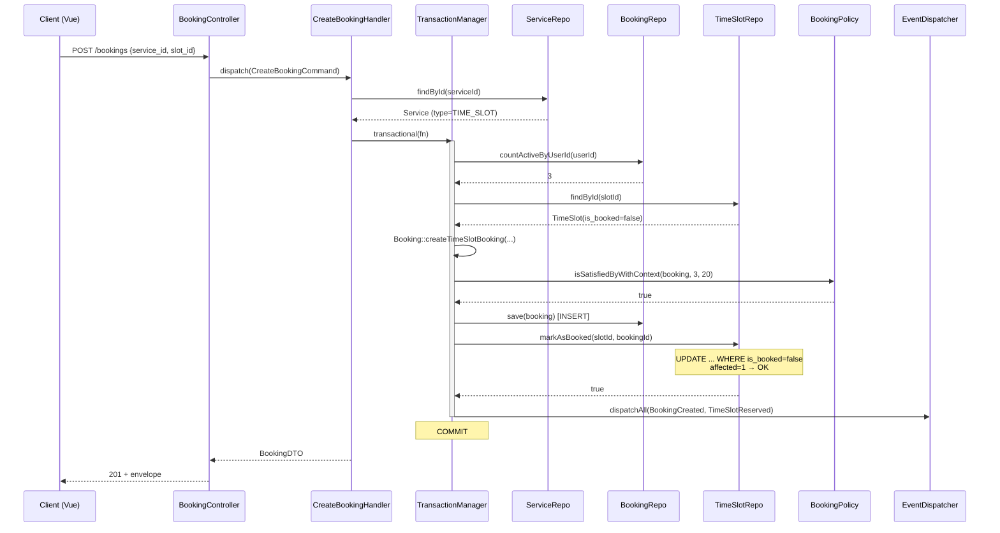
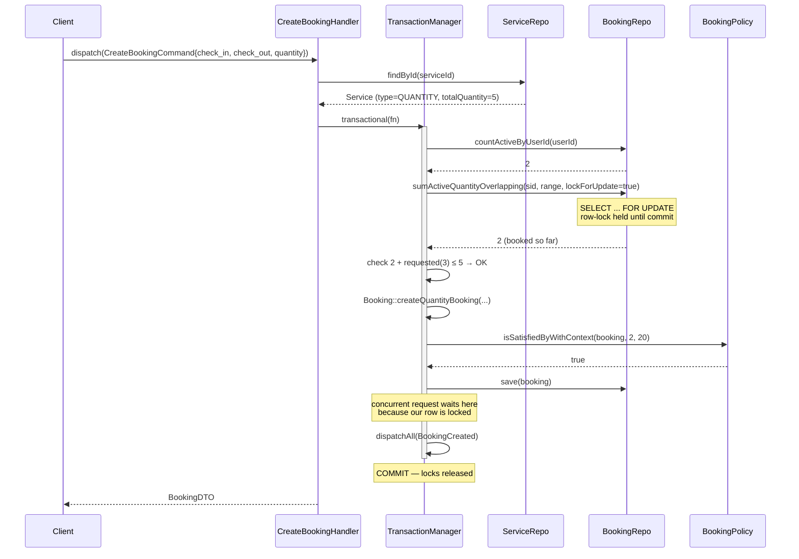
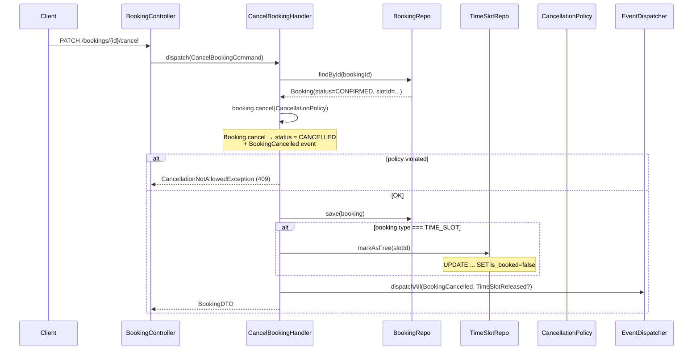

# Booking Module

> Bounded Context: бронирование, временные слоты, проверка доступности (core)

## Обзор

Booking — центральный BC букинг-платформы. Инкапсулирует весь lifecycle бронирования: создание, подтверждение, отмену, завершение. Модуль универсальный — поддерживает **две принципиально разные семантики** в одном aggregate `Booking`:

1. **TIME_SLOT** — привязка к конкретному `TimeSlot` (консультация на 14:00, теннисный корт на час). Инвариант: один слот = одно бронирование.
2. **QUANTITY** — N единиц на диапазон дат (5 номеров отеля с 1 по 5 мая, 10 велосипедов с завтра на сутки). Инвариант: сумма активных бронирований не превышает `Service.totalQuantity` на любой overlapping-диапазон.

Выбор семантики определяется `ServiceType` из Catalog BC. Несоответствие входных данных типу услуги → `InvalidBookingTypeException` (HTTP 409).

Booking BC полностью **self-contained** — не слушает чужих событий, но публикует свои. Будущие консьюмеры (Payment, Notification) интегрируются через Laravel-events или Outbox на своей стороне.

Главное архитектурное требование Booking BC — **конкурентная безопасность**. Прод работает на PostgreSQL, тесты тоже (см. [ADR-011](../adr/011-booking-concurrency-strategy.md) и [ADR-001](../adr/001-modular-monolith.md)).

## Архитектурные решения

### Dual-type в одном Aggregate

Можно было разделить на `TimeSlotBooking` и `QuantityBooking` (два разных aggregate). Решили объединить в один `Booking` с `BookingType` enum + nullable-полями, потому что:

- Общий lifecycle: PENDING → CONFIRMED → COMPLETED / CANCELLED
- Общие domain-правила: `CancellationPolicy`, `WithinBookingWindow`, `UserNotExceedsLimit`
- Общая БД-таблица `bookings` — один индекс, один repository, одна миграция
- Разные правила инкапсулированы в фабричных методах (`createTimeSlotBooking` / `createQuantityBooking`) и в `CreateBookingHandler` через `match($service->type())`

Если dual-type расширится до 4+ типов со специфичной логикой — выделяем в отдельные aggregate (review: >500 LOC в `Booking`).

### Strategy Pattern для Availability

Проверка доступности — контекстно-зависимая операция:

- TIME_SLOT: "какие слоты свободны на дату X?"
- QUANTITY: "сколько единиц доступно на диапазон X–Y?"

Разные возвращаемые типы (`TimeSlotAvailabilityDTO` vs `QuantityAvailabilityDTO`), разные репозитории (`TimeSlotRepository` vs `BookingRepository`), разные входные параметры.

`AvailabilityChecker` — dispatcher, который выбирает стратегию по `Service.type`. Это изолирует `CheckAvailabilityHandler` от знаний про конкретный тип. Добавление нового типа — новая стратегия + enum-значение в Catalog, без правок существующих.

### Specification с composition

Бизнес-правила Booking BC — много мелких независимых предикатов:

- "не в прошлом", "не далеко в будущем" → `WithinBookingWindow`
- "лимит активных на пользователя" → `UserNotExceedsLimit`
- "можно отменить сейчас?" → `WithinCancellationWindow` AND `BookingNotAlreadyCompleted`

Специфика Booking — правила **комбинируются разными способами**:

- При создании — `BookingPolicy = WithinBookingWindow AND UserNotExceedsLimit`
- При отмене — `CancellationPolicy = WithinCancellationWindow AND BookingNotAlreadyCompleted`

Specification Pattern (см. [pattern doc](../patterns/specification-pattern.md)) даёт композицию через AND / OR / NOT без размножения if'ов и тестируемость атомарных правил по одному.

### TransactionManager вместо DB facade

`CreateBookingHandler` — критическая транзакция (row-lock + agg + INSERT). Прямое использование `DB::transaction` в handler'е — это импорт Laravel в Application-слой (запрещено [ddd.md](../../.claude/rules/ddd.md)).

Решение: `Shared\Application\Transaction\TransactionManagerInterface` — абстракция. Infra реализует через `LaravelTransactionManager`, в тестах можно подставить no-op или in-memory. Handler testable без Laravel app.

## Aggregates / Entities

- **Booking** (aggregate root) — [`Domain/Entity/Booking.php`](../../backend/app/Modules/Booking/Domain/Entity/Booking.php)
- **TimeSlot** (aggregate root) — [`Domain/Entity/TimeSlot.php`](../../backend/app/Modules/Booking/Domain/Entity/TimeSlot.php)

Поля и actions — см. [README модуля](../../backend/app/Modules/Booking/README.md#aggregates--entities).

## Value Objects

`BookingId`, `SlotId`, `BookingStatus`, `BookingType`, `TimeRange`, `DateRange`, `Quantity` — см. [README](../../backend/app/Modules/Booking/README.md#value-objects).

## State Machine бронирования



Переходы защищены:

- `confirm()` бросает `InvalidBookingStateTransitionException` если статус не PENDING
- `complete()` бросает `InvalidBookingStateTransitionException` если статус не CONFIRMED
- `cancel()` проверяет `CancellationPolicy` — не даёт отменить COMPLETED или за пределами cancellation-окна

`CANCELLED` и `COMPLETED` — терминальные, `BookingStatus::isFinal()` возвращает `true`.

## Concurrency deep-dive

### TIME_SLOT: атомарный conditional UPDATE

Сценарий race: Alice и Bob одновременно жмут "Забронировать" на один и тот же слот.

Без защиты:

```
Alice: SELECT slot → is_booked=false
Bob:   SELECT slot → is_booked=false
Alice: UPDATE slot SET is_booked=true
Bob:   UPDATE slot SET is_booked=true   -- опа, двойное бронирование
```

Решение — `markAsBooked` в `EloquentTimeSlotRepository`:

```sql
UPDATE time_slots
   SET is_booked = true, booking_id = :booking_id
 WHERE id = :slot_id
   AND is_booked = false
```

PostgreSQL возвращает число affected rows. Handler интерпретирует:

- `affected = 1` → наш INSERT прошёл, мы владельцы слота
- `affected = 0` → слот уже был занят (is_booked=true), бросаем `SlotUnavailableException` (HTTP 409)

Conditional WHERE — атомарный, не нужен SELECT-FOR-UPDATE. PG обрабатывает conditional UPDATE одной операцией под row-lock внутри себя.

### QUANTITY: SELECT FOR UPDATE + PHP aggregation

Сценарий race: Alice бронирует 3 номера с 1 по 5 мая, Bob — 4 номера с 3 по 7 мая. `totalQuantity = 5`. Диапазоны overlap'ят — каждая транзакция по отдельности видит только свой sum.

Без защиты:

```
Alice: SELECT SUM(quantity) overlapping 1–5 → 0 (пусто)
Bob:   SELECT SUM(quantity) overlapping 3–7 → 0
Alice: check 0+3 ≤ 5 → OK, INSERT
Bob:   check 0+4 ≤ 5 → OK, INSERT  -- опа, 7 > 5
```

Решение — `sumActiveQuantityOverlapping(..., lockForUpdate: true)`:

```sql
SELECT id, quantity FROM bookings
 WHERE service_id = :sid
   AND type = 'quantity'
   AND status IN ('pending', 'confirmed')
   AND check_in  <  :check_out
   AND check_out >  :check_in
   FOR UPDATE
```

Row-lock держится до commit'а транзакции (handler обёрнут в `TransactionManagerInterface::transactional`). Alice блокирует свои рядки — Bob ждёт. Когда Alice коммитит, Bob пересчитывает sum (уже видит Alice's insert) и получает `3+4 > 5` → `InsufficientQuantityException`.

**Почему SUM в PHP, а не в SQL?** PG не поддерживает `SELECT SUM(...) FOR UPDATE`:

```
ERROR: FOR UPDATE is not allowed with aggregate functions
```

Приходится брать строки (они лочатся row-by-row) и суммировать в приложении. Overhead незаметен: overlapping-bookings мало (обычно < 20 строк), round-trip один.

### Транзакционные границы

`CreateBookingHandler::handle` использует `TransactionManagerInterface::transactional`:

```php
return $this->tx->transactional(function () use ($cmd, $service): BookingDTO {
    // 1. count user active bookings
    // 2. build Booking entity (factory валидирует инварианты)
    // 3. check BookingPolicy
    // 4. save Booking (INSERT)
    // 5. TIME_SLOT: markAsBooked — возвращает false → throw
    //    QUANTITY: lock уже взят в sumActiveQuantityOverlapping шаге 2
    // 6. dispatch events
    // 7. return DTO
});
```

Если любой шаг падает — rollback, locks отпускаются, чужие конкурентные транзакции разблокируются и проверяют актуальное состояние.

### Проверки, покрывающие race

- Unit-тесты mock'ают репозитории и проверяют error paths
- `ConcurrentBookingTest` (Feature) — fork'ает N процессов, параллельно жмёт endpoint с одним slot_id / overlapping-диапазоном, проверяет что успешен ровно один (или для QUANTITY — что sum(успешных) ≤ totalQuantity). Требует реального PostgreSQL, запускается в docker-compose.test.yml.

## Sequence diagrams

### Create TIME_SLOT booking flow



### Create QUANTITY booking flow



### Cancel flow



## Примеры кода

### Customer создаёт TIME_SLOT бронирование

```php
// Vue -> API (axios)
const response = await client.post<ApiResponse<BookingDto>>('/bookings', {
    service_id: '018f-...',
    slot_id: '018c-...',
    notes: 'First-time visit',
});
```

Backend flow (упрощённо):

```php
// BookingController::store
$cmd = new CreateBookingCommand(
    userId: $request->user()->id,
    serviceId: $request->validated('service_id'),
    slotId:    $request->validated('slot_id'),
    notes:     $request->validated('notes'),
);
$dto = $this->commandBus->dispatch($cmd);

return response()->json(new BookingResource($dto), 201);
```

### Admin подтверждает бронирование

Filament Action в `BookingResource`:

```php
ConfirmBookingAction::make()
    ->action(function ($record) use ($commandBus): void {
        $commandBus->dispatch(new ConfirmBookingCommand($record->id));
    });
```

Handler дёрнет `Booking::confirm()` → `BookingConfirmed` event.

### Customer отменяет бронирование

```php
// PATCH /bookings/{id}/cancel
PATCH /api/v1/bookings/018f-abc/cancel
→ 200 OK
{
  "success": true,
  "data": { "id": "018f-abc", "status": "cancelled", "...": "..." },
  "error": null,
  "meta": null
}
```

Если `CancellationPolicy` не выполнена:

```json
{
  "success": false,
  "data": null,
  "error": {
    "code": "BOOKING_CANCELLATION_NOT_ALLOWED",
    "message": "Cancellation window closed (less than 24h before start)",
    "details": {}
  },
  "meta": null
}
```

## Extending

### Добавить третий тип booking (SEATS для кинотеатра)

Кейс: выбрать конкретные места в зале (ряд + номер), N мест за раз.

1. **Catalog BC** — добавить `ServiceType::SEATS` enum value (`app/Modules/Catalog/Domain/ValueObject/ServiceType.php`), обновить `Service::assertInvariants` (новый инвариант: `seatsMap !== null`).
2. **Booking BC**:
   - Добавить `BookingType::SEATS` + нужные VO (`SeatId`, `SeatSelection`).
   - Новая стратегия `SeatsAvailabilityStrategy` — реализует `AvailabilityStrategyInterface`, возвращает map "seat → free/booked".
   - Зарегистрировать стратегию в `AvailabilityChecker::__construct`.
   - Новый фабричный метод `Booking::createSeatsBooking(...)`.
   - В `CreateBookingHandler` — новая ветка `match($service->type()) { ..., ServiceType::SEATS => $this->createSeatsBooking(...) }`.
   - Новое поле в миграции `bookings` (например `seat_ids jsonb`).
3. **API** — валидация в `CreateBookingRequest` для полей `seat_ids`.
4. **Frontend** — новый компонент `SeatMapPicker`.

Существующие TIME_SLOT / QUANTITY ветки не трогаются. Specifications в большинстве переиспользуются (окно, лимиты, completion).

## Testing

### Unit

Где: [`tests/Unit/Modules/Booking/`](../../backend/tests/Unit/Modules/Booking/)

Что покрыто:

- `Domain/ValueObject/*` — валидация конструкторов
- `Domain/Entity/BookingTest` — фабрики, state transitions, invariants, события
- `Domain/Entity/TimeSlotTest` — reserve/release, защита от двойной reserve
- `Domain/Specification/*` — каждая спецификация отдельно, композиты через mock-стратегии
- `Domain/Service/AvailabilityChecker*` — dispatch по типу
- `Application/Command/*Handler*` — все 6 handler'ов через Mockery (repositories + dispatcher + tx)

### API (HTTP feature)

Где: [`tests/Feature/Api/Booking/`](../../backend/tests/Feature/Api/Booking/) — 20 тестов против реального PG.

Покрытие:

- `CreateBookingTest` — TIME_SLOT success, QUANTITY success, slot_already_booked (409), insufficient_quantity (409), invalid_type (409), not_authenticated (401), validation (422)
- `CancelBookingTest` — success, not_owner (403), not_found (404), already_cancelled, cancellation_window_closed (409)
- `CheckAvailabilityTest` — оба типа, missing params (422)
- `ListUserBookingsTest` — pagination, ownership, status filter

### Concurrency

Где: [`tests/Feature/Booking/ConcurrentBookingTest.php`](../../backend/tests/Feature/Booking/ConcurrentBookingTest.php)

Fork-based stress: запускает N concurrent процессов, каждый пытается забронировать один и тот же slot (для TIME_SLOT) или overlapping-диапазон (для QUANTITY). Ассёртит:

- TIME_SLOT: ровно одно создание success, остальные получили `SlotUnavailableException`
- QUANTITY: сумма quantity успешных не превышает `totalQuantity`

Зависит от PostgreSQL (SQLite не поддерживает `FOR UPDATE`).

### E2E (known limitation)

Где: [`frontend/e2e/spec/booking/`](../../frontend/e2e/spec/booking/) — 10 тестов.

Моккают backend через `page.route` — причина в том, что SPA пока не имеет JWT login flow / axios auth interceptor (scope Plan 8/9). Моки соблюдают контракт (response envelope, коды ошибок) — но не проверяют реальную HTTP-интеграцию.

Backend contract compensates это 20-ю feature-тестами против реального PG + concurrency-тестом.

## Ссылки

- [README модуля](../../backend/app/Modules/Booking/README.md)
- [ADR-011 Booking concurrency strategy](../adr/011-booking-concurrency-strategy.md)
- [ADR-007 Read-side без Eloquent](../adr/007-read-side-without-eloquent.md)
- [ADR-004 Specification Pattern](../adr/004-specification-pattern.md)
- [patterns/domain-events.md](../patterns/domain-events.md)
- [patterns/specification-pattern.md](../patterns/specification-pattern.md)
- Код: [`backend/app/Modules/Booking/`](../../backend/app/Modules/Booking/)
