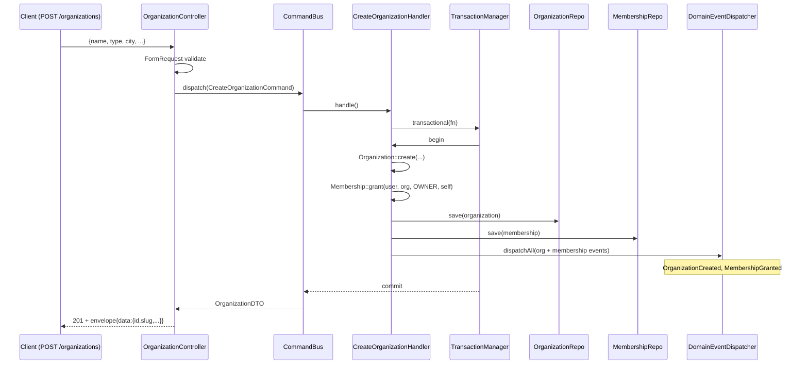
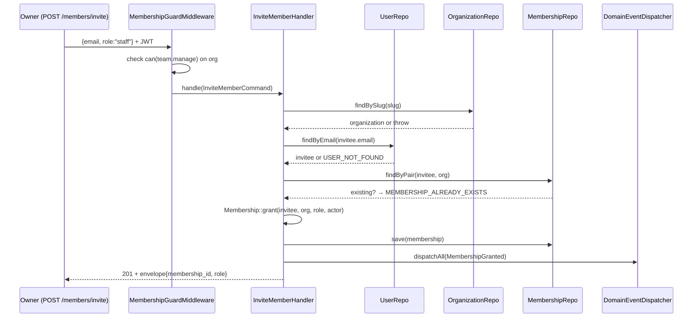
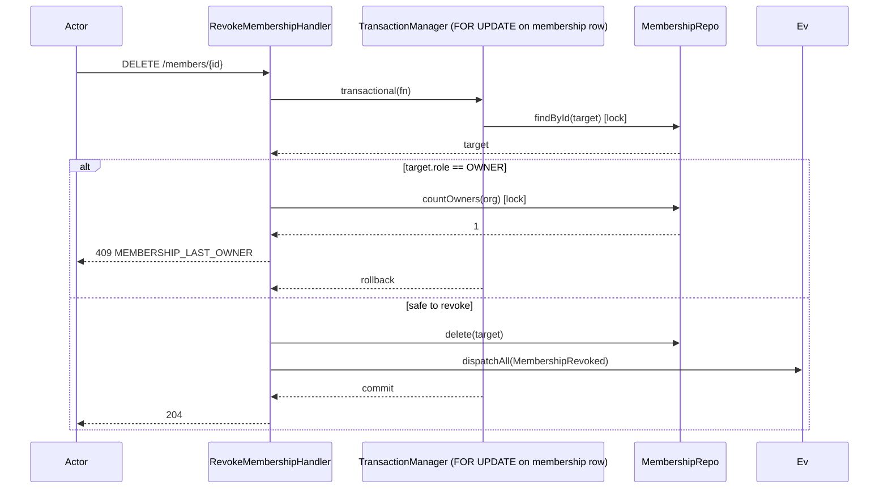
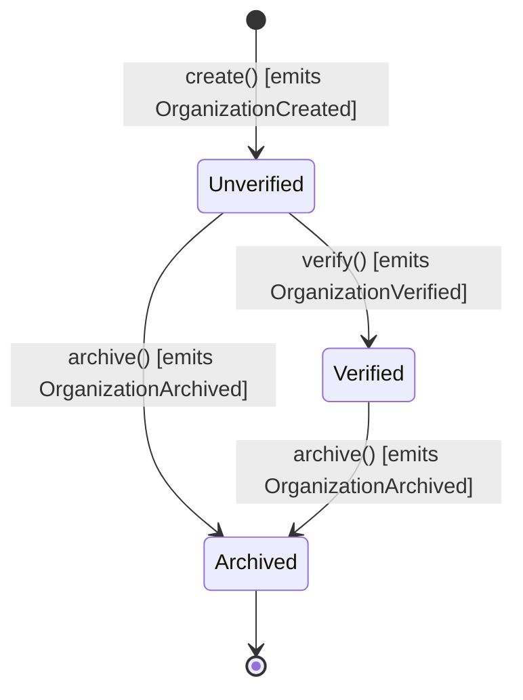

# Identity Module

Bounded context для аутентификации, пользователей, **организаций и membership'ов**. Источник правды для быстрого reference — [`backend/app/Modules/Identity/README.md`](../../backend/app/Modules/Identity/README.md). Этот документ — deep-dive с диаграммами и обоснованиями решений.

## Архитектура

Identity — 4 слоя Clean Architecture (см. `docs/architecture/clean-architecture.md`):

```
app/Modules/Identity/
├── Domain/                 # чистый PHP, 0 зависимостей от Laravel
│   ├── Entity/             # User, Role, Organization, Membership
│   ├── ValueObject/        # Email, FullName, HashedPassword,
│   │                       # OrganizationId/Slug/Type, MembershipId/Role,
│   │                       # CancellationPolicy, UserId, RoleId, RoleName
│   ├── Event/              # 10+ domain events
│   ├── Repository/         # UserRepo, RoleRepo, OrganizationRepo, MembershipRepo (интерфейсы)
│   ├── Service/            # PasswordHasherInterface, SlugGeneratorInterface
│   └── Exception/          # DuplicateEmail, InvalidCredentials,
│                           # OrganizationNotFound, MembershipAlreadyExists,
│                           # MembershipLastOwner и др.
├── Application/
│   ├── Command/            # 13 use cases: RegisterUser, AssignRole, CreateOrganization,
│   │                       # UpdateOrganization, VerifyOrganization, ArchiveOrganization,
│   │                       # AdminArchiveOrganization, InviteMember, RevokeMembership,
│   │                       # ChangeMembershipRole и др.
│   ├── Query/              # GetUserProfile, ListUsers, GetOrganization,
│   │                       # GetOrganizationBySlug, ListOrganizationMembers,
│   │                       # ListUserMemberships
│   ├── DTO/                # UserDTO, OrganizationDTO, MembershipDTO, MembershipWithOrgDTO
│   └── Service/            # AuthService, JwtTokenServiceInterface, ParsedClaims,
│                           # UserMembershipsLookupInterface
├── Infrastructure/
│   ├── Persistence/
│   │   ├── Model/          # UserModel, RoleModel, RefreshTokenModel,
│   │   │                   # OrganizationModel, MembershipModel
│   │   ├── Repository/     # EloquentUserRepository, Organization/Membership repos
│   │   └── Mapper/         # *Mapper (Domain ↔ Eloquent)
│   ├── Auth/               # JwtTokenService, JwtGuard, JwtUserProvider, BcryptPasswordHasher
│   └── Service/            # PgSlugGenerator (транслитерация RU + collision-safe)
└── Interface/
    ├── Api/
    │   ├── Controller/     # AuthController, OrganizationController,
    │   │                   # OrganizationMembersController, MeMembershipsController
    │   ├── Middleware/     # JwtAuthMiddleware, MembershipGuardMiddleware
    │   ├── Request/ Resource/
    │   └── routes.php
    └── Filament/
        ├── Resource/       # UserResource, OrganizationResource, MembershipResource
        ├── Action/         # AssignRole/RevokeRole/Verify/ArchiveOrganization
        ├── Page/
        └── Listener/       # SyncSpatieRoleOn*
```

## Ключевые архитектурные решения

### User + Organization + Membership — orthogonal axes

Вместо "User has type = provider | customer" (one-user-one-role) решили разнести:

- **User** — учётная запись. Живёт сам по себе, может быть customer'ом, staff'ом, owner'ом, любой комбинацией одновременно.
- **Organization** — provider в marketplace. Отдельный aggregate с собственным lifecycle.
- **Membership** — явная ассоциация с organization-level ролью. Отдельный aggregate root (изменения эмитят свои events).

Это даёт:

- **Dual-role users** — тот же user может бронировать услуги (customer) и управлять своим салоном (owner) без отдельных аккаунтов.
- **Multi-org staff** — мастер ходит по нескольким салонам, одна учётка с 3-4 membership'ами.
- **Extensibility** — добавим Airbnb-like host model без изменения User.

Альтернативы рассматривались в [ADR-012](../adr/012-organizations-memberships.md).

### Membership permissions вместо hard-coded role checks

Controllers не пишут `if ($role === 'owner') { ... }`. Вместо этого middleware `MembershipGuardMiddleware` принимает permission-string, лезет в `MembershipRole::can($permission)`:

```php
Route::patch('/organizations/{slug}', [OrganizationController::class, 'update'])
    ->middleware('org.member:settings.manage');
```

Матрица permissions — единственный source of truth (`enum MembershipRole::PERMISSIONS`). Добавление нового permission — правка одной константы, code review тривиален.

### Last-owner invariant на уровне domain

`Membership::revoke()` и `Membership::changeRole()` не знают про "последний ли". Knowledge принадлежит handler'у, который запрашивает `MembershipRepository::countOwners(orgId)` и эмитит `MembershipLastOwnerException` если revoke/change оставляет org без owner'ов. Handler идёт под `TransactionManager::transactional` — между `countOwners` и `update` стоит row-level lock (через `SELECT ... FOR UPDATE`), защищая от race-condition одновременных revoke'ов двух owner'ов.

### JWT memberships claim — read-only hint, не source of truth

В JWT access-токен (1h TTL) кладётся `memberships` claim — снимок на момент issue. **Middleware не доверяет claim'у** для критичных операций — `MembershipGuardMiddleware` читает актуальное membership из PG. Claim нужен для:

- Быстрого UI (фронт рисует org-switcher без fetch'а).
- Read-only endpoint'ов (`/me/memberships` отдаёт прямо из claim'а).
- Short-lived rate-limits / logging.

Refresh token обновляет claim — revoked membership исчезает к следующему 1h-windows, что приемлемо для marketplace UX.

## Flow диаграммы

### CreateOrganization flow



### InviteMember flow



### Last-owner revocation



## Organization lifecycle



- `verify()` — idempotent, второй раз не эмитит event.
- `archive()` — idempotent, terminal (нет unarchive в aggregate; если нужно — миграция флага из админки).
- Catalog BC наблюдает `archivedAt IS NULL` при выдаче services в каталог — так archived org автоматически выпадает из customer search.

## Расширение системы

### Добавить новую platform role

1. Расширить `RoleName` enum (`backend/app/Modules/Identity/Domain/ValueObject/RoleName.php`).
2. Добавить запись в `SpatieRoleSeeder`.
3. Обновить Filament `canAccessPanel` / Resource policies если роль должна иметь доступ.

### Добавить новый permission / membership role

1. Добавить значение в `MembershipRole` enum (если новая роль).
2. Расширить `MembershipRole::PERMISSIONS` — одно место, строковые ключи.
3. Middleware `MembershipGuardMiddleware` подхватит автоматически через `can($permission)`.
4. Unit-тест в `tests/Unit/Modules/Identity/Domain/ValueObject/MembershipRoleTest.php`.

### Добавить поле в Organization

1. Миграция: `ALTER TABLE organizations ADD COLUMN ...`.
2. Поле в `Organization` aggregate + update*() метод с emit `OrganizationUpdated`.
3. Update `OrganizationMapper` (Domain ↔ Eloquent).
4. Update `UpdateOrganizationCommand` / `FormRequest` / `OrganizationResource` (API response shape).
5. Filament: extend `OrganizationResource::infolist` и table column.

## Ссылки

- Код: [`backend/app/Modules/Identity/`](../../backend/app/Modules/Identity/)
- API envelope: [`docs/api/envelope.md`](../api/envelope.md)
- Аутентификация: [`docs/api/authentication.md`](../api/authentication.md)
- ADR dual-auth: [`docs/adr/003-jwt-customer-session-admin.md`](../adr/003-jwt-customer-session-admin.md)
- ADR Spatie + domain roles: [`docs/adr/010-spatie-permission-with-domain-roles.md`](../adr/010-spatie-permission-with-domain-roles.md)
- ADR organizations + memberships: [`docs/adr/012-organizations-memberships.md`](../adr/012-organizations-memberships.md)
- Тесты: [`backend/tests/Feature/Api/Auth/`](../../backend/tests/Feature/Api/Auth/), [`backend/tests/Feature/Api/Identity/`](../../backend/tests/Feature/Api/Identity/)
